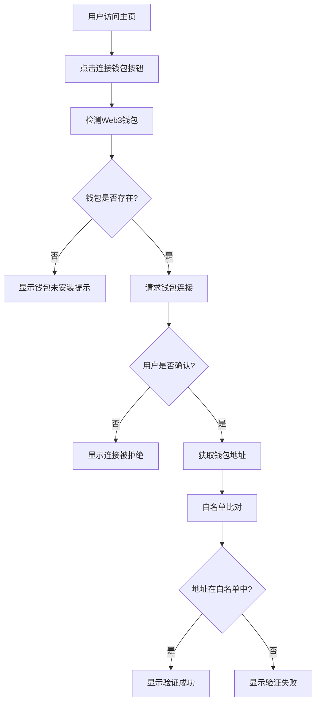

# Web3钱包白名单验证系统 - 产品需求文档

## 1. 产品概述
一个基于Web3的钱包连接和白名单验证系统，允许用户通过连接加密钱包来验证其地址是否在项目方的白名单中。
该产品主要解决项目方需要对特定用户群体进行身份验证的需求，通过去中心化的方式确保只有授权用户能够访问特定功能或服务。

## 2. 核心功能

### 2.1 用户角色
| 角色 | 注册方式 | 核心权限 |
|------|----------|----------|
| 普通用户 | 通过Web3钱包连接 | 可以连接钱包并进行白名单验证 |
| 项目管理员 | 系统预设 | 可以管理白名单地址列表 |

### 2.2 功能模块
我们的Web3钱包验证系统包含以下主要页面：
1. **主页**：钱包连接入口、系统介绍、验证状态显示
2. **验证页面**：钱包连接界面、验证结果展示、错误处理

### 2.3 页面详情
| 页面名称 | 模块名称 | 功能描述 |
|----------|----------|----------|
| 主页 | 系统介绍 | 展示系统功能说明和使用指南 |
| 主页 | 钱包连接入口 | 提供"连接钱包"按钮，引导用户开始验证流程 |
| 主页 | 连接状态显示 | 显示当前钱包连接状态和用户地址 |
| 验证页面 | 钱包连接模块 | 检测并连接MetaMask等主流Web3钱包 |
| 验证页面 | 地址获取 | 获取用户钱包地址并显示 |
| 验证页面 | 白名单比对 | 将用户地址与预设白名单进行比较验证 |
| 验证页面 | 结果展示 | 显示验证成功或失败的提示信息 |
| 验证页面 | 错误处理 | 处理钱包未安装、连接失败等异常情况 |

## 3. 核心流程
**用户验证流程：**
1. 用户访问网站主页
2. 用户点击"连接钱包"按钮
3. 系统检测用户浏览器中的Web3钱包（如MetaMask）
4. 用户在钱包中确认连接请求
5. 系统获取用户钱包地址
6. 系统将地址与白名单进行比对
7. 显示验证结果（成功或失败）

## 4. 用户界面设计
### 4.1 设计风格
- **主色调**：深蓝色 (#1E3A8A) 和亮蓝色 (#3B82F6)
- **辅助色**：绿色 (#10B981) 表示成功，红色 (#EF4444) 表示失败
- **按钮样式**：圆角矩形，3D效果，悬停时有阴影变化
- **字体**：主标题使用 24px，正文使用 16px，等宽字体显示钱包地址
- **布局风格**：卡片式布局，居中对齐，响应式设计
- **图标风格**：使用简洁的线性图标，钱包、检查标记等Web3相关图标

### 4.2 页面设计概览
| 页面名称 | 模块名称 | UI元素 |
|----------|----------|--------|
| 主页 | 系统介绍 | 大标题、说明文字、渐变背景、卡片容器 |
| 主页 | 钱包连接入口 | 大型蓝色按钮、钱包图标、悬停效果 |
| 主页 | 连接状态显示 | 状态指示器、地址显示框、复制按钮 |
| 验证页面 | 钱包连接模块 | 加载动画、连接进度指示、钱包选择界面 |
| 验证页面 | 地址获取 | 地址显示卡片、等宽字体、复制功能 |
| 验证页面 | 白名单比对 | 验证进度条、加载动画、状态图标 |
| 验证页面 | 结果展示 | 成功/失败卡片、彩色背景、图标提示 |
| 验证页面 | 错误处理 | 错误提示框、重试按钮、帮助链接 |

### 4.3 响应式设计
系统采用移动端优先的响应式设计，支持桌面端、平板和手机端访问。在移动端优化触摸交互，按钮大小适合手指点击，文字大小保证可读性。