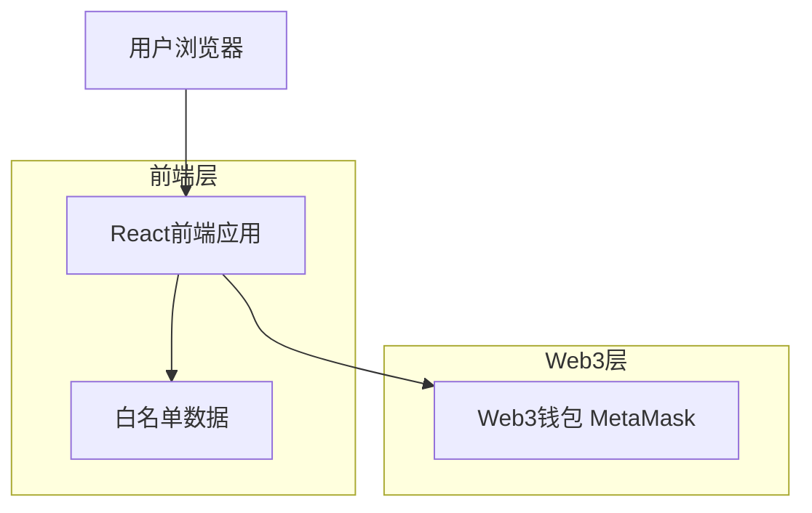
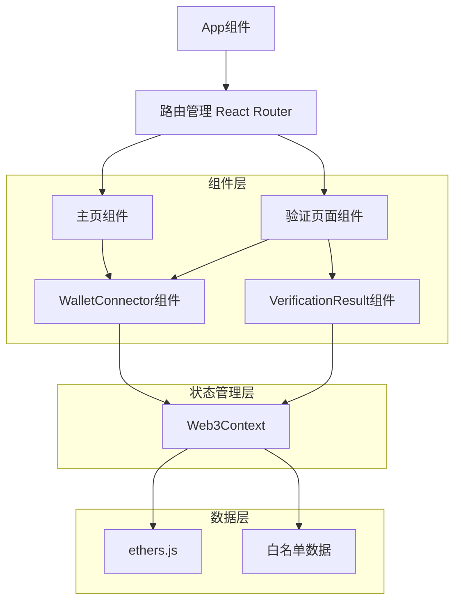
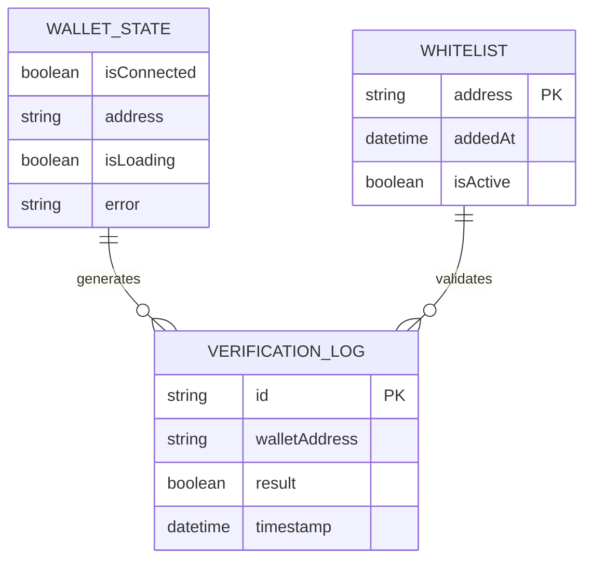

# Web3钱包白名单验证系统 - 技术架构文档

## 1. 架构设计



## 2. 技术描述
- **前端**: React@18 + TypeScript + Tailwind CSS@3 + Vite
- **Web3集成**: ethers.js@6 或 web3.js@4
- **状态管理**: React Context API
- **UI组件**: 自定义组件 + Headless UI
- **构建工具**: Vite

## 3. 路由定义
| 路由 | 用途 |
|------|------|
| / | 主页，显示系统介绍和钱包连接入口 |
| /verify | 验证页面，处理钱包连接和白名单验证流程 |

## 4. API定义
### 4.1 Web3钱包交互

钱包连接
```typescript
interface WalletConnection {
  connect(): Promise<string>
  disconnect(): void
  getAddress(): Promise<string>
  isConnected(): boolean
}
```

白名单验证
```typescript
interface WhitelistVerification {
  checkAddress(address: string): Promise<boolean>
  getWhitelist(): string[]
}
```

### 4.2 核心数据类型

```typescript
// 钱包状态
interface WalletState {
  isConnected: boolean
  address: string | null
  isLoading: boolean
  error: string | null
}

// 验证结果
interface VerificationResult {
  success: boolean
  message: string
  address: string
}

// 白名单配置
interface WhitelistConfig {
  addresses: string[]
  lastUpdated: Date
}
```

## 5. 前端架构图



## 6. 数据模型

### 6.1 数据模型定义



### 6.2 数据定义

白名单数据结构
```typescript
// 白名单地址列表（存储在前端配置文件中）
const WHITELIST_ADDRESSES = [
  "0x742d35Cc6634C0532925a3b8D4C9db96C4b4d8b1",
  "0x8ba1f109551bD432803012645Hac136c22C177e9",
  "0x1234567890123456789012345678901234567890",
  // ... 更多地址
];

// 验证历史记录（存储在localStorage中）
interface VerificationHistory {
  id: string;
  address: string;
  result: boolean;
  timestamp: number;
}
```

初始化数据
```typescript
// 默认钱包状态
const initialWalletState: WalletState = {
  isConnected: false,
  address: null,
  isLoading: false,
  error: null
};

// 白名单配置
const whitelistConfig: WhitelistConfig = {
  addresses: WHITELIST_ADDRESSES,
  lastUpdated: new Date()
};
```